# Relatório de Análise da Demanda de Aeronaves

## 1. Introdução

O objetivo deste relatório é analisar a relação entre indicadores econômicos e operacionais como a movimentação de passageiros na cidade de Joinville. Inicialmente, foi testada a influência do PIB per capita sobre a movimentação, seguida da exploração de outras variáveis explicativas disponíveis na base de dados municipal. A análise busca identificar quais fatores melhor explicam a variação na movimentação anual de passageiros, utilizando modelos de regressão.

## 2. Descrição de Dados

Foram utilizadas três bases de dados principais:
- PIB per capita;
- Movimentação Anual de Passageiros;
- Indicadores Diversos de Joinville.

Dentre estes se destacam:
- PIB per capita;
- Movimentação Anual de Passageiros;
- População;
- Tarifa média;
- Yield (R$/KM);
- Assentos Comerciais;
- Distância média voada.

## 3. Descrição estatística das variáveis

### Gráfico de Dispersão
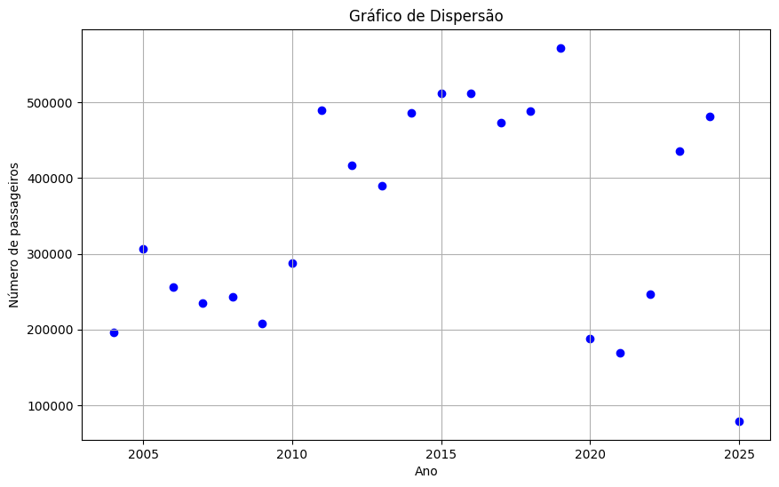  
*Fonte: Ferreira (2009)*

### Matriz de Correlação
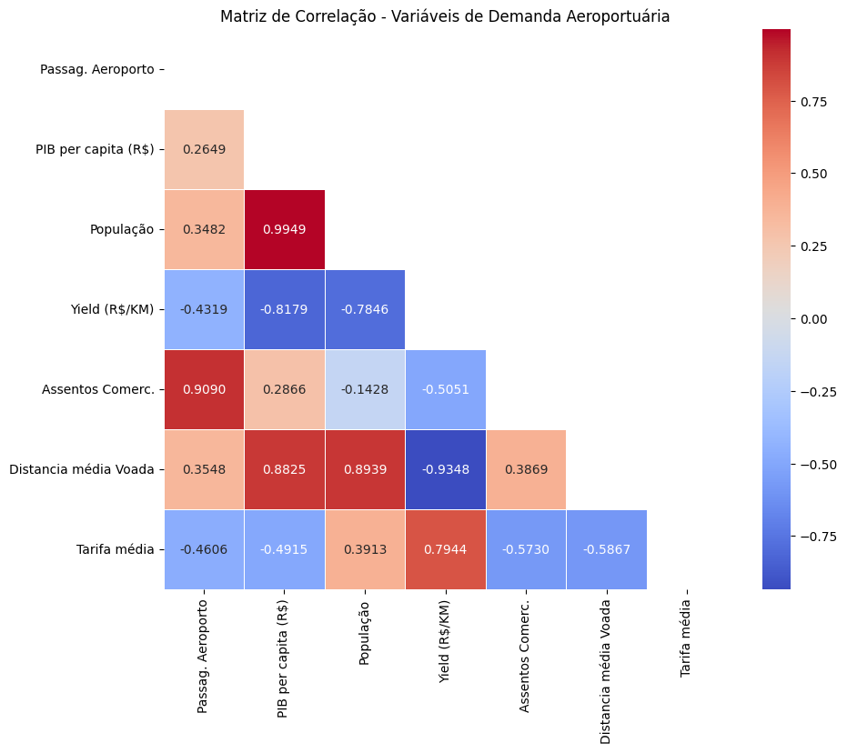  
*Fonte: Elaborado pelos autores.*

### Tabela de Correlação

| Variável 1            | Variável 2           | Correlação  |
|-----------------------|----------------------|-------------|
| População             | PIB per capita (R$)  | 0.994879    |
| Distância média Voada | Yield (R$/KM)        | -0.934800   |
| Assentos Comerc.      | Passag. Aeroporto    | 0.909036    |
| Distância média Voada | População            | 0.893875    |
| Distância média Voada | PIB per capita (R$)  | 0.882521    |

## 4. Formulação dos modelos de regressão

### 4.1. Distância Média de Voo x PIB per capita

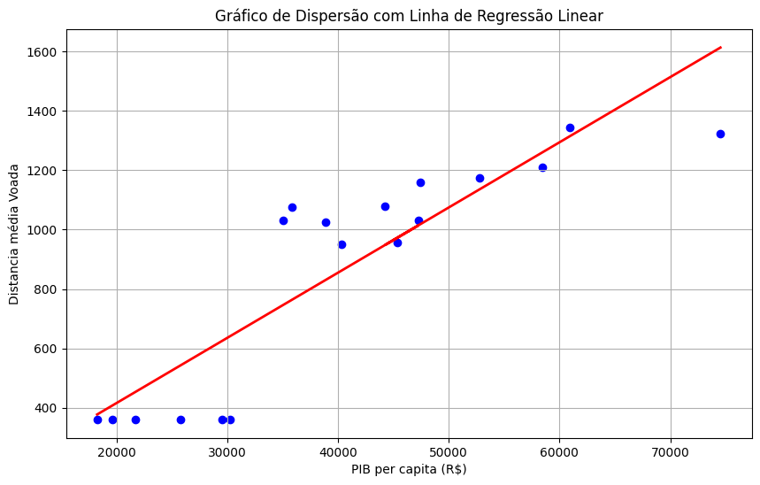  
**Figura 1**: Modelos de regressão utilizando forma funcional linear.  
*Fonte: Elaborados pelos autores.*

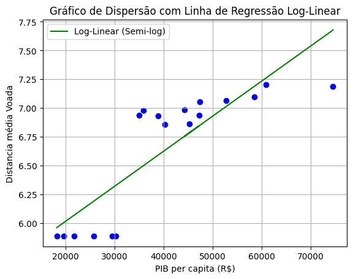  
**Figura 2**: Modelos de regressão utilizando forma funcional log-linear.  
*Fonte: Elaborados pelos autores.*

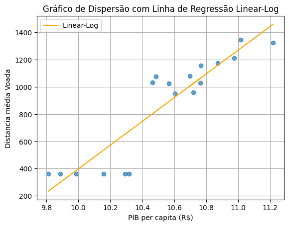  
**Figura 3**: Modelos de regressão utilizando forma funcional linear-log.  
*Fonte: Elaborados pelos autores.*

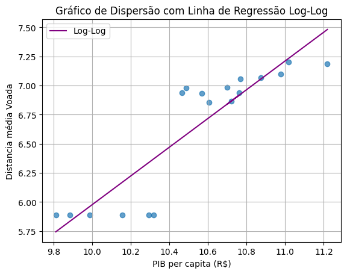  
**Figura 4**: Modelos de regressão utilizando forma funcional log-log.  
*Fonte: Elaborados pelos autores.*

### 4.2. Distância Média de Voo x Yield (R$/KM)

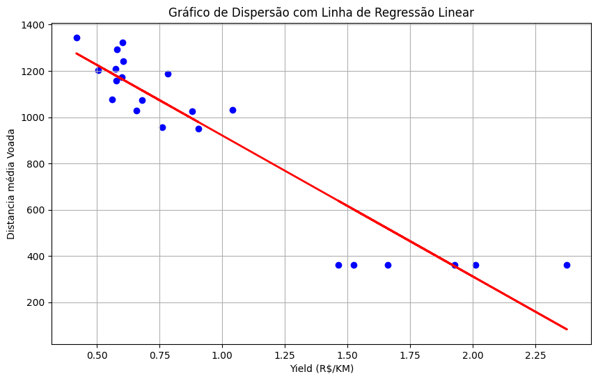  
**Figura 5**: Modelos de regressão utilizando forma funcional linear.  
*Fonte: Elaborados pelos autores.*

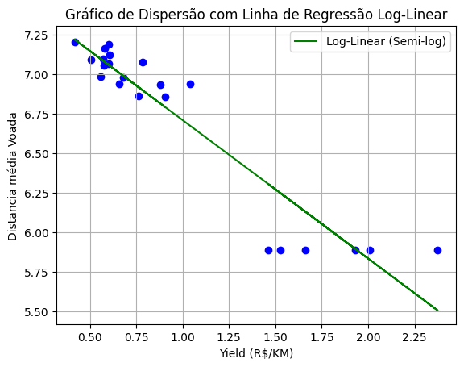  
**Figura 6**: Modelos de regressão utilizando forma funcional log-linear.  
*Fonte: Elaborados pelos autores.*

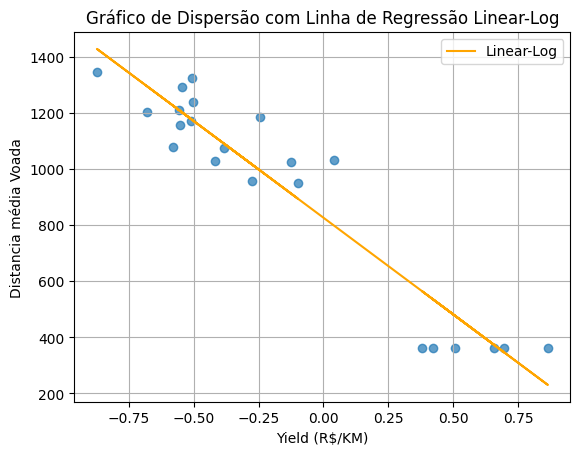  
**Figura 7**: Modelos de regressão utilizando forma funcional linear-log.  
*Fonte: Elaborados pelos autores.*

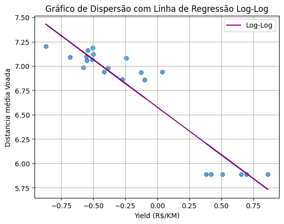  
**Figura 8**: Modelos de regressão utilizando forma funcional log-log.  
*Fonte: Elaborados pelos autores.*

### 4.4. Passageiros por Ano x Assentos Comerciais
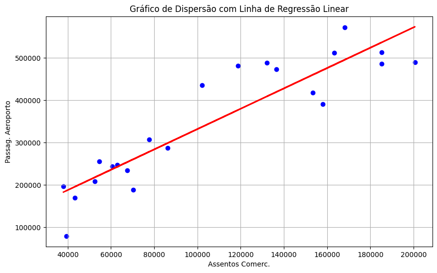  
**Figura 9**: Modelos de regressão utilizando forma funcional linear.  
*Fonte: Elaborados pelos autores.*

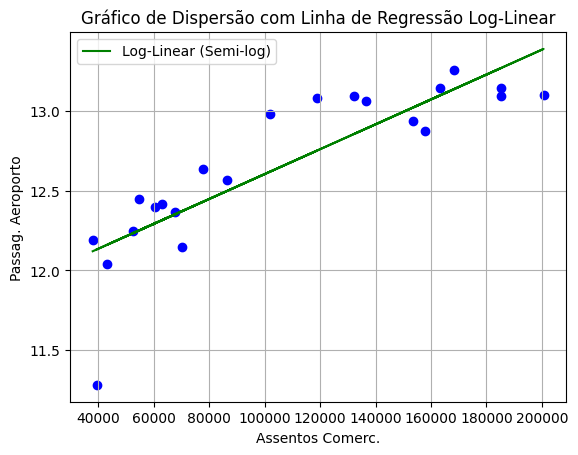  
**Figura 10**: Modelos de regressão utilizando forma funcional log-linear.  
*Fonte: Elaborados pelos autores.*

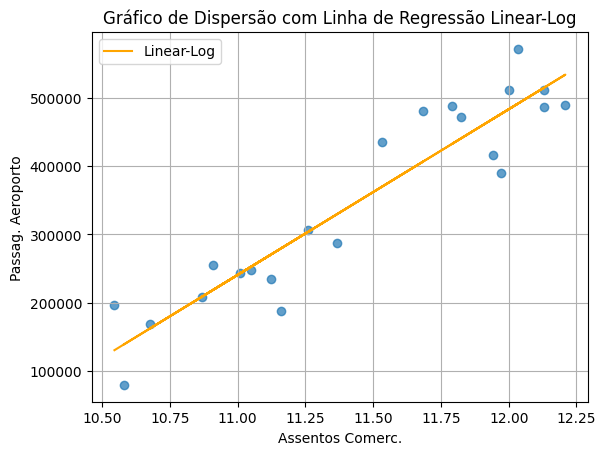  
**Figura 11**: Modelos de regressão utilizando forma funcional linear-log.  
*Fonte: Elaborados pelos autores.*

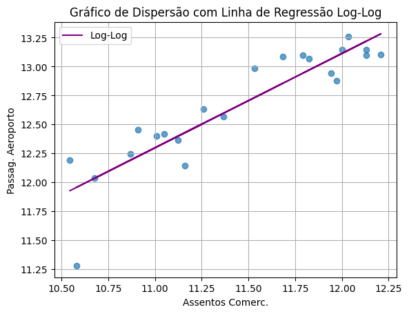  
**Figura 12**: Modelos de regressão utilizando forma funcional log-log.  
*Fonte: Elaborados pelos autores.*

## 5. Estimativa dos coeficientes utilizando o método dos Mínimos Quadrados Ordinários (OLS)

### 5.1. Distância Média de Voo x PIB per capita
- **Linear Regression**: β₀ = 312.2876, β₁ = 0.0163  
- **Log-linear Regression**: β₀ = 5.8641, β₁ = 2.2719e-05  
- **Linear-log Regression**: β₀ = -4519.3838, β₁ = 521.8931  
- **Log-log Regression**: β₀ = -1.0312, β₁ = 0.7427  

### 5.2. Distância Média de Voo x Yield (R$/KM)
- **Linear Regression**: β₀ = 1530.3733, β₁ = -609.2280  
- **Log-linear Regression**: β₀ = 7.5858, β₁ = -0.8751  
- **Linear-log Regression**: β₀ = 826.8078, β₁ = -689.5150  
- **Log-log Regression**: β₀ = 6.5772, β₁ = -0.9771  

### 5.3. Passageiros por Ano x Assentos Comerciais
- **Linear Regression**: β₀ = 91712.1641, β₁ = 2.3998  
- **Log-linear Regression**: β₀ = 11.8237, β₁ = 7.8127e-06  
- **Linear-log Regression**: β₀ = -2430181.2976, β₁ = 242803.4252  
- **Log-log Regression**: β₀ = 3.3467, β₁ = 0.8138  

### 5.5. Avaliar a significância estatística dos coeficientes

## 6. Verificação das hipóteses clássicas da regressão

### 6.1. Distância Média de Voo x PIB per capita
- **Teste RESET de Ramsey**: estatística = 7.3185, p-valor = 0.0258, df_denom = 2  
- **Teste de White**: 'LM Statistic': 0.1145, 'LM-Test p-valor': 0.9444, 'F-Statistic': 0.0480, 'F-Test p-valor': 0.9533  
- **Estatística Durbin-Watson**: 0.9519  
- **VIF**: [8.4051, 1.0]  

### 6.2. Distância Média de Voo x Yield (R$/KM)
- **Teste RESET de Ramsey**: estatística = 17.3813, p-valor = 0.0002, df_denom = 2  
- **Teste de White**: 'LM Statistic': 6.9790, 'LM-Test p-valor': 0.0305, 'F-Statistic': 4.4139, 'F-Test p-valor': 0.0266 
- **Estatística Durbin-Watson**: 2.5872  
- **VIF**: [4.1327, 1.0]  

### 6.3. Passageiros por Ano x Assentos Comerciais
- **Teste RESET de Ramsey**: estatística = 24.4410, p-valor = 4.9283e-06, df_denom = 2  
- **Teste de White**: 'LM Statistic': 1.3382, 'LM-Test p-valor': 0.5122, 'F-Statistic': 0.6153, 'F-Test p-valor': 0.5509
- **Estatística Durbin-Watson**: 1.2891  
- **VIF**: [5.0897, 1.0]  

# Seleção do modelo mais adequado

## Distância Média de Voo x PIB per capita

- **Modelo**: Linear  
  - AIC: 240.7139734128535  
  - BIC: 242.49471692864583  
  - R-squared: 0.778842704857219  
  - Adjusted R-squared: 0.7650203739107951  
  - F-test p-value: 1.2541712620839091e-06  
---

- **Modelo**: Log-linear  
  - AIC: 10.174835224971496  
  - BIC: 11.955578740763825  
  - R-squared: 0.7123615029231332  
  - Adjusted R-squared: 0.694384096855829  
  - F-test p-value: 1.06714862909993e-05  
---

- **Modelo**: Linear-log  
  - AIC: 235.81013823190182  
  - BIC: 237.59088174769414  
  - R-squared: 0.8315836978488752  
  - Adjusted R-squared: 0.8210576789644299  
  - F-test p-value: 1.378631268270841e-07  
---

- **Modelo**: Log-log  
  - AIC: 4.259949372544035  
  - BIC: 6.040692888336364  
  - R-squared: 0.7929211365361468  
  - Adjusted R-squared: 0.779978707569656  
  - F-test p-value: 7.35290757460248e-07  
---

**Melhor modelo baseado em AIC**: Log-log  
**Melhor modelo baseado em BIC**: Log-log  
**Melhor modelo baseado em R-squared**: Linear-log  
**Melhor modelo baseado em Adjusted R-squared**: Linear-log

---

## Distância Média de Voo x Yield (R$/KM)

- **Modelo**: Linear  
  - AIC: 280.2605742843522  
  - BIC: 282.4426591910688  
  - R-squared: 0.8738519203396552  
  - Adjusted R-squared: 0.867544516356638  
  - F-test p-value: 1.9110735388559346e-10  
---

- **Modelo**: Log-linear  
  - AIC: -9.801459335730357  
  - BIC: -7.619374429013725  
  - R-squared: 0.8837925954207556  
  - Adjusted R-squared: 0.8779822251917934  
  - F-test p-value: 8.367580677914155e-11  
---

- **Modelo**: Linear-log  
  - AIC: 275.5449031481787  
  - BIC: 277.72698805489534  
  - R-squared: 0.8981900577083833  
  - Adjusted R-squared: 0.8930995605938025  
  - F-test p-value: 2.2131162671286824e-11  
---

- **Modelo**: Log-log  
  - AIC: -9.872584479372435  
  - BIC: -7.690499572655803  
  - R-squared: 0.8841676827882137  
  - Adjusted R-squared: 0.8783760669276244  
  - F-test p-value: 8.099839771586406e-11  
---

**Melhor modelo baseado em AIC**: Log-log  
**Melhor modelo baseado em BIC**: Log-log  
**Melhor modelo baseado em R-squared**: Linear-log  
**Melhor modelo baseado em Adjusted R-squared**: Linear-log

---

## Distância Média de Voo x Assentos Comerciais

- **Modelo**: Linear  
  - AIC: 549.2361704430607  
  - BIC: 551.4182553497774  
  - R-squared: 0.8263456680246661  
  - Adjusted R-squared: 0.8176629514258994  
  - F-test p-value: 4.788631025703021e-09  
---

- **Modelo**: Log-linear  
  - AIC: 6.145537615775552  
  - BIC: 8.327622522492184  
  - R-squared: 0.7262275397370973  
  - Adjusted R-squared: 0.7125389167239522  
  - F-test p-value: 4.81045935133018e-07  
---

- **Modelo**: Linear-log  
  - AIC: 542.3754369239838  
  - BIC: 544.5575218307005  
  - R-squared: 0.8728693621983309  
  - Adjusted R-squared: 0.8665128303082474  
  - F-test p-value: 2.066297326687235e-10  
---

- **Modelo**: Log-log  
  - AIC: -2.2479487719617737  
  - BIC: -0.06586386524514154  
  - R-squared: 0.8130623355951515  
  - Adjusted R-squared: 0.803715452374909  
  - F-test p-value: 1.0080185169593796e-08  
---

**Melhor modelo baseado em AIC**: Log-log  
**Melhor modelo baseado em BIC**: Log-log  
**Melhor modelo baseado em R-squared**: Linear-log  
**Melhor modelo baseado em Adjusted R-squared**: Linear-log

---

# Interpretação econômica dos coeficientes estimados

## Explicar o significado das elasticidades ou semi-elasticidades
## Relacionar os resultados com a teoria econômica

---

# Validação do modelo

## Dividir os dados em amostra de treinamento e teste (opcional)
## Avaliar a capacidade preditiva do modelo
