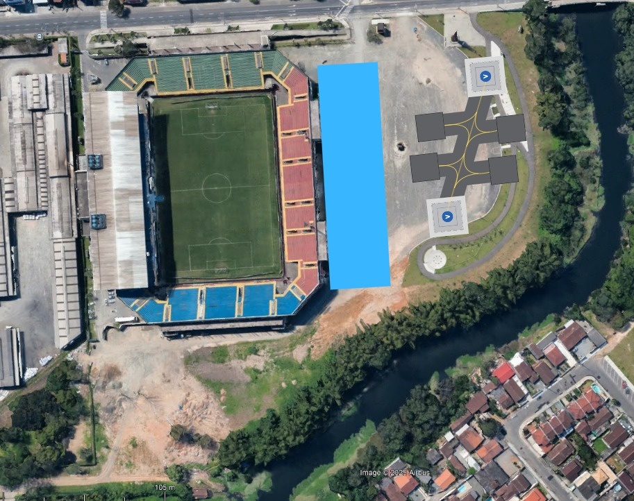

# Análise espacial do Vertiporto

## 1. Espaço disponível

De acordo com a seção de Localização Ótima de vertiporto o sítio selecionado foi a região próxima à Arena, abaixo são apresentadas as principais dimensões do espaço lateral ao estádio.

## 2. Posicionamento das FATOs

A configuração a seguir foi cuidadosamente definida com o objetivo de maximizar a ocupação do espaço disponível na ARENA Joinville, sem comprometer as operações regulares de jogos e eventos esportivos. Para isso, foram considerados aspectos fundamentais do projeto de implantação do vertiporto, como a escolha estratégica das localizações das FATOs (Final Approach and Take-Off areas), dos stands de estacionamento das aeronaves, bem como a separação clara entre o lado ar e o lado terra, respeitando todas as exigências operacionais e de segurança. 

A primeira FATO tem como rumo 330 e 180º. 

A segunda FATO tem como rumo 200 e 70º.

Além disso, foi projetado um terminal de passageiros funcional e integrado, garantindo fluidez no embarque e desembarque, conforto aos usuários e compatibilidade com o fluxo de pessoas já existente nas atividades do estádio. Essa abordagem busca assegurar a convivência harmônica entre as operações do vertiporto e os eventos da ARENA, promovendo mobilidade aérea urbana de forma eficiente e segura.

## 3. Fluxo de passageiros/hora

Para a análise de fluxo de pessoas por hora, foram considerados dois voos por hora, com uma lotação máxima de 4 passageiros e 1 piloto por voo. Considerando a utilização de duas FATOS, os valores encontrados para pax/hora são apresentados abaixo.

