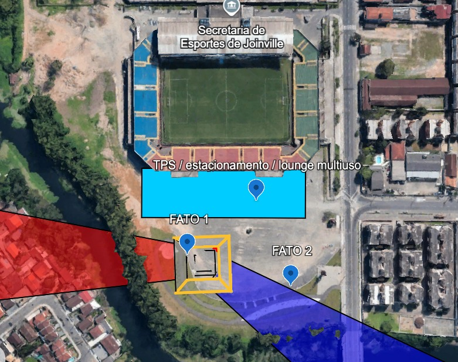

## Projeto do lado ar do Vertiporto

Com o sítio definido nas imediações da Arena Joinville, em Joinville (SC), deu-se início ao projeto da parte ar do vertiporto, com base nas legislações nacionais aplicáveis, na seleção de um veículo eVTOL de referência e nos cálculos técnicos necessários para garantir a segurança e eficiência operacional da infraestrutura.

### Legislação de referência

- RBAC 155 (ANAC, 2024)

- ICA 11-408 (DECEA, 2020)

### Projeto de Vertiporto

O dimensionamento foi realizado com base no eVTOL Eve, cujo diâmetro de referência (D) é de 15,2 m, representando o menor círculo que envolve a projeção da aeronave em planta horizontal. A estrutura principal do vertiporto em Joinville contempla os seguintes elementos:

- TLOF (Touchdown and Lift-Off Area): Duas áreas de pouso e decolagem, com formato quadrado de 15,2 m × 15,2 m, dimensionadas com 1 × D, adequada para operação em solo.

- FATO (Final Approach and Take-Off Area): Área que envolve a TLOF, também quadrada, com 22,8 m × 22,8 m, correspondente a 1,5 × D.

- Área de Segurança: Zona livre de obstáculos ao redor da FATO, com 30,4 m × 30,4 m, ou seja, 2 × D.

  

Em seguida, foram realizados o dimensionamento do local para comportar quatro stands, com as vias de trânsito entre eles.

#### Posicionamento das FATOs

A configuração a seguir foi cuidadosamente definida com o objetivo de maximizar a ocupação do espaço disponível na ARENA Joinville, sem comprometer as operações regulares de jogos e eventos esportivos. 

Para isso, foram considerados aspectos fundamentais do projeto de implantação do vertiporto, como a escolha estratégica das localizações das FATOs (Final Approach and Take-Off areas), dos stands de estacionamento das aeronaves, bem como a separação clara entre o lado ar e o lado terra, respeitando todas as exigências operacionais e de segurança. 

A primeira FATO tem como rumo 330 e 180º, 26°19'01"S 48°49'55"W.

A segunda FATO tem como rumo 200 e 70º, 26°18'58"S 48°49'54"W.

Além disso, foi projetado um terminal de passageiros funcional e integrado, garantindo fluidez no embarque e desembarque, conforto aos usuários e compatibilidade com o fluxo de pessoas já existente nas atividades do estádio. Essa abordagem busca assegurar a convivência harmônica entre as operações do vertiporto e os eventos da ARENA, promovendo mobilidade aérea urbana de forma eficiente e segura.

#### Fluxo de passageiros/hora

Para a análise de fluxo de pessoas por hora, foram considerados dois voos por hora, com uma lotação máxima de 4 passageiros e 1 piloto por voo. Considerando a utilização de duas FATOS, os valores encontrados para pax/hora são apresentados abaixo.

