# Localização Ótima de Vertiporto

A escolha do sítio é avaliada mediante critérios hierarquizados pelo método AHP, com a agregação das prioridades individuais (AIP) para decisão coletiva, resultando na seleção do local mais adequado.

## Seleção e justificativa dos critérios

- **Infraestrutura disponível** – Área e serviços próximos disponíveis para a implantação do vertiporto, aproveitando recursos já existentes;

- **Ruído** - Evita incômodos à população, auxiliando a aceitação social e garantindo conformidade com as regulamentações locais;

- **Acessibilidade** – Recurso que atende à necessidade de acesso ao vertiporto, com fácil integração com outros modais, como rodoviário, por exemplo;

- **Privacidade** - Evita operações próximas a áreas residências ou restritas, mitigando potenciais conflitos;

- **Eficiência** – Reflete diretamente no potencial de funcionamento do vertiporto, levando em consideração sua atração e demanda;

- **Horas de operação** – Facilita a escolha de regiões com menos restrições horárias que impactam diretamente nas operações;

- **Impacto ambiental** – Auxilia a escolha do local de menor impacto ambiental possível, atendendo as normas ambientais;

- **Segurança** - Minimiza riscos de toda a operação, veículos e áreas adjacentes ao vertiporto, sendo um dos critérios mais importantes para definir a escolha do sítio;

## POSSÍVEIS SÍTIOS

### 1. UNIVERSIDADE DE JOINVILLE /SHOPPING GARTEN

Localizado ao norte de Joinville, próximo ao Garten Shopping e à Universidade de Joinville. Região de alta atividade comercial e educacional, com fácil acesso pelas principais vias da cidade.

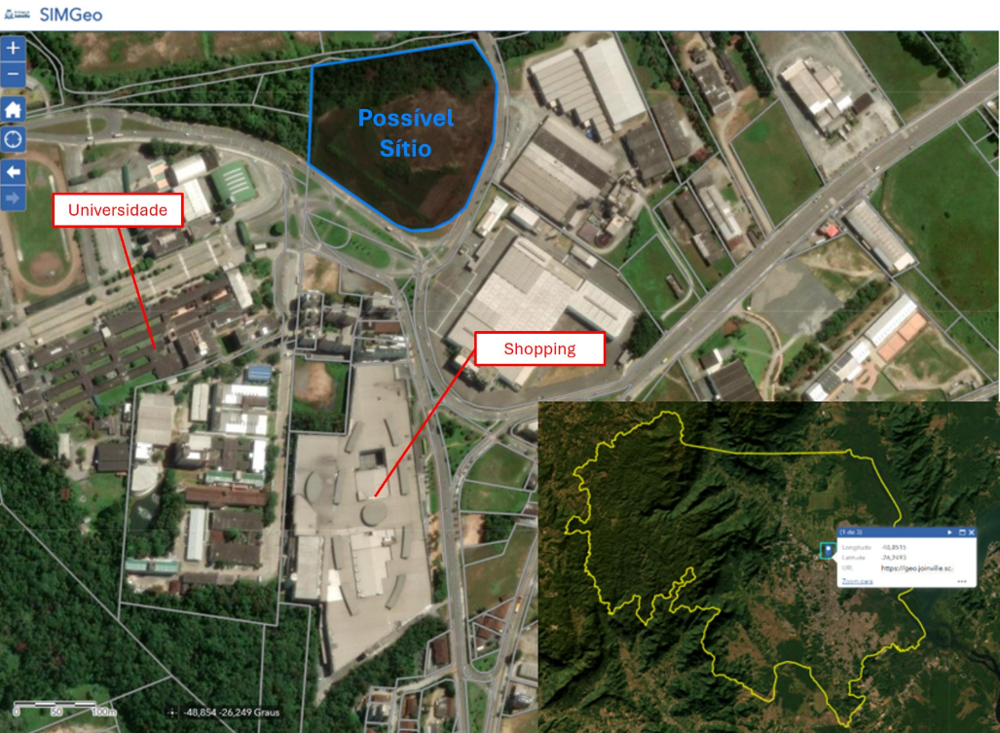

**Motivo de Escolha**

- Integração com atividades comerciais e universitárias;

- Forte geração de fluxo diário;

- Boa infraestrutura urbana instalada;

**Vantagens**

- Acessibilidade fácil pelas principais avenidas;

- Presença de estacionamentos amplos;

- Área urbana consolidada e segura;

**Desvantagens**

- Possível restrição de operação em horários de pico;

- Conflitos com o fluxo de pedestres e veículos;

- Sensibilidade ao ruído próximo de áreas residenciais e educativas;

### 2. TERMINAL NORTE / CENTRO DE DISTRIBUIÇÃO DE ENERGIA

Localizado em uma zona logística e industrial ao norte da cidade, próximo ao Terminal Norte e a um centro de distribuição. Área com menos adensamento residencial e alta capacidade de operação.

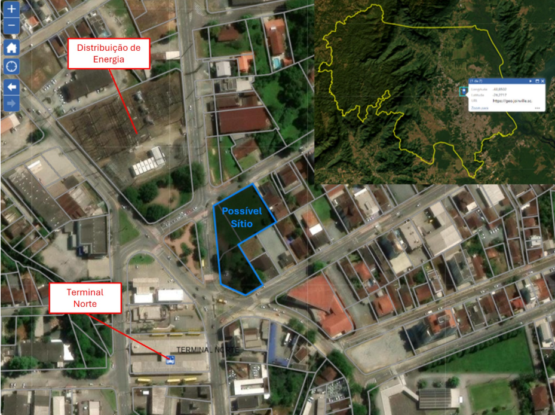

**Motivo de Escolha**

- Operações de carga e descarga existentes;

- Fácil acesso logístico para veículos;

- Menor sensibilidade a ruído;

**Vantagens**

- Menor impacto ambiental e social;

- Área ampla para expansão;

- Conexão direta com vias logísticas;

**Desvantagens**

- Menor fluxo de passageiros espontâneo;

- Necessidade de melhorias na acessibilidade pública (transporte coletivo);

- Distância maior dos centros urbanos residenciais;

### 3. ESTACIONAMENTO ARENA JOINVILLE

Área ampla localizada no estacionamento da Arena Joinville, no bairro Bucarein. Próxima a vias arteriais e à zona central de Joinville, com facilidade de acesso e boa visibilidade.

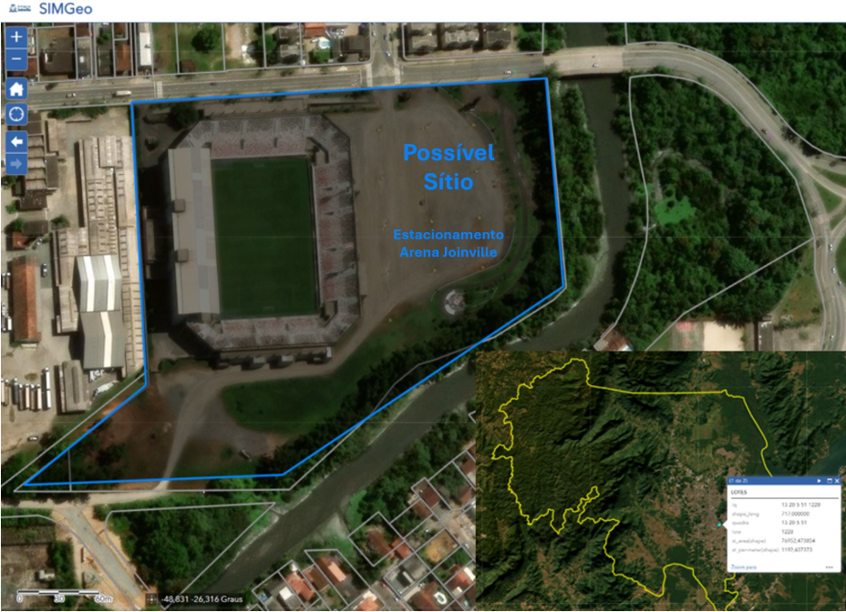

**Motivo de Escolha**

- Próximo do centro da cidade;

- Estrutura já preparada para grandes eventos;

- Grande área disponível para adaptação;

**Vantagens**

- Facilidade para atender alta demanda em eventos;

- Boa integração modal (vias principais próximas);

- Presença de segurança já instalada (eventos);

**Desvantagens**

- Concorrência de uso com eventos esportivos e culturais;

- Possíveis restrições de horários e operações nos dias de jogos;

- Requer adaptações para operações contínuas;

**Localização dos sítios escolhidos**

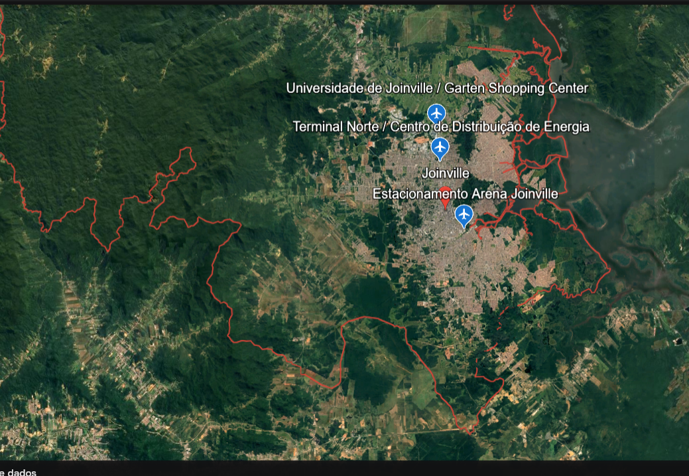

Fonte: Adaptado de Google Earth

### AHP e AIP Sítios

Com o uso do AHP para avaliar os sítios em relação a cada critério, torna-se possível aplicar a AIP para consolidar as prioridades e definir uma classificação geral entre todas as alternativas de sítio.

AIP dos sítios de acordo com os critérios e notas do grupo

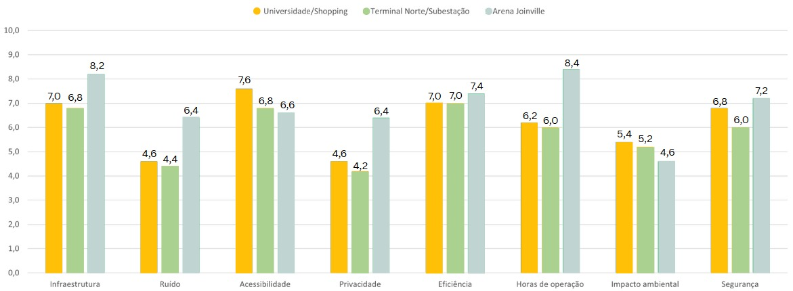

Fonte: Autores

Considerando a prioridade entre os critérios e a avaliação dos sítios com base nos critérios escolhidos, determina-se o local ótimo para a implantação do vertiporto, sendo selecionado a Arena Joinville.

Comparação entre a média da nota dos sítios, com escolha a partir do AIP do grupo

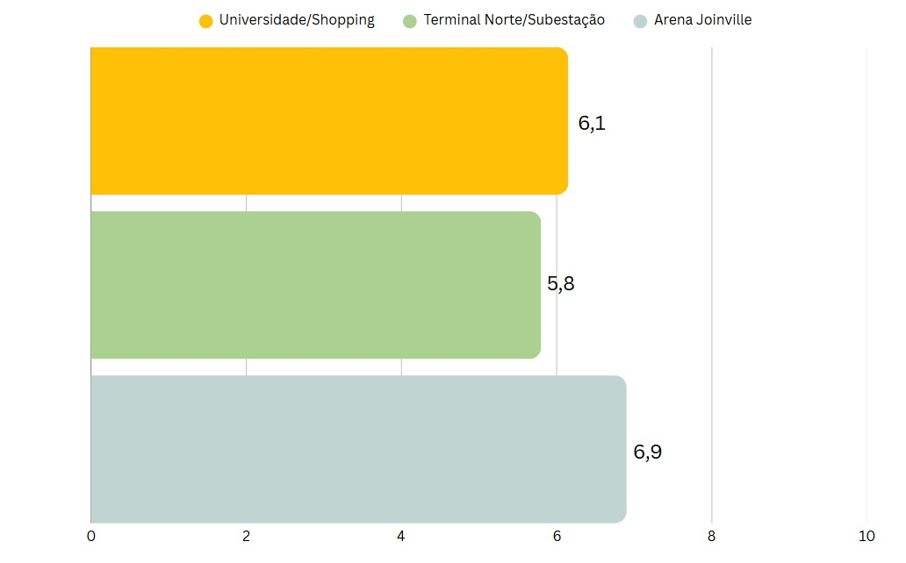

Fonte: Autores

### Zoneamento e Modelagem de Demanda

Para estimar a demanda e analisar as viagens entre vertiportos e macrozonas, o espaço urbano é dividido em zonas de estudo, e aplicam-se modelos que simulam o comportamento de escolha dos usuários. Nesse processo, utilizam-se o Modelo de Gravidade e o Modelo de Huff, que permitem estimar o fluxo de viagens e a probabilidade de utilização dos vertiportos.

### Divisão em Macrozonas

Para nossa análise, a cidade foi dividida em cinco regiões geográficas, ou macrozonas:

- Centro Norte
- Sul
- Leste
- Oeste
- Pirabeiraba

**Regiões mais populosas**: Centro Norte e Sul 

**Regiões com maior densidade populacional**: Centro Norte e Sul

Subprefeituras de Joinville - SC

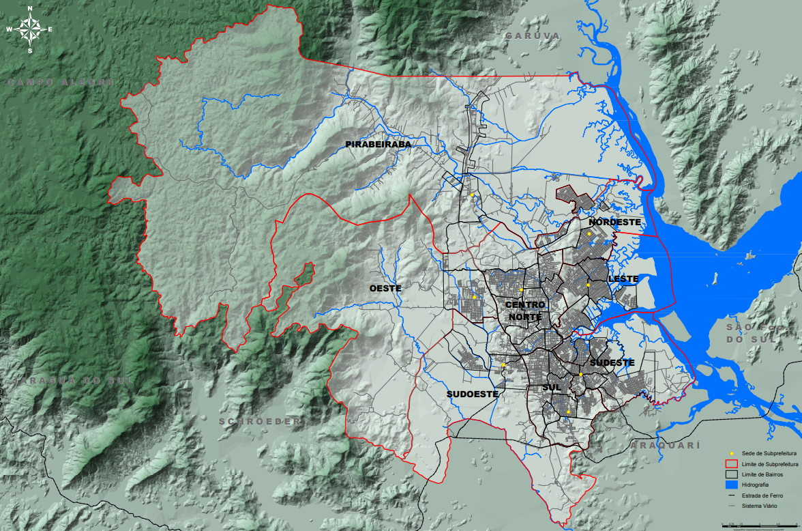

Fonte: <https://www.joinville.sc.gov.br/publicacoes/mapas-das-regioes-de-abrangencia-das-subprefeituras-do-municipio-de-joinville/>

### Caracterização de cada macrozona quanto a aspectos socioeconômicos e de uso do solo

Embora para a cidade de Joinville, dados específicos de renda per capita distribuídos por macrozonas não estão disponíveis, foi feita uma análise baseada na concentração populacional por macrozona, polos empregatícios e PIB per capita da cidade.

PIB PER CAPITA – Joinville SC (2021)

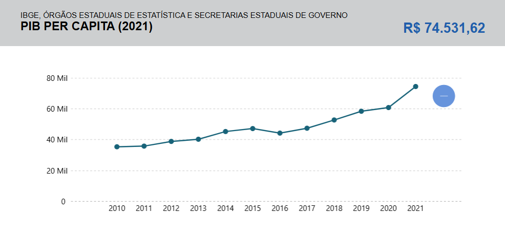

Fonte: IBGE

Concentração de vínculos empregatícios (total)

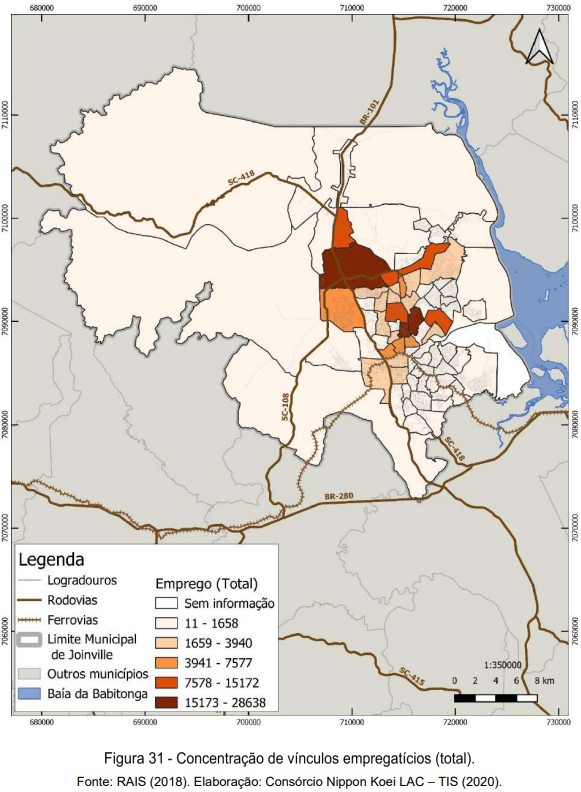

Fonte: [2]

Concentração da população em 2010

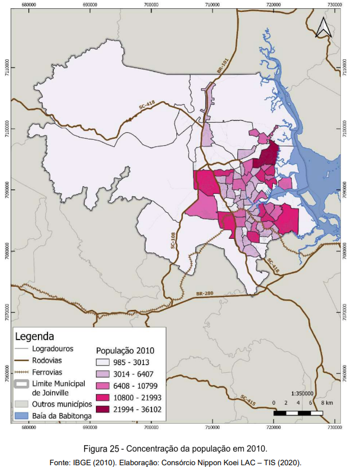

Fonte: [2]

Média diária de viagens geradas por zona

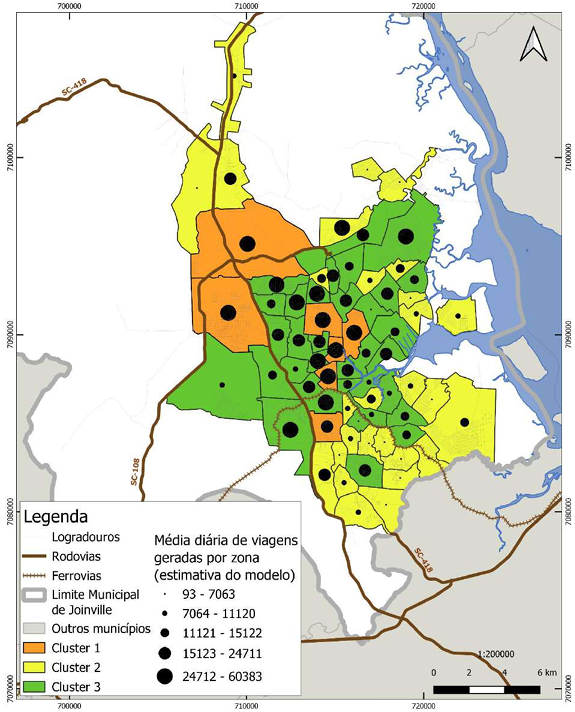

Fonte: <https://www.joinville.sc.gov.br/wp-content/uploads/2023/05/Pesquisa-Origem-e-Destino-2019.pdf>

**Principais Regiões de Origem das Viagens:**

- Centro Norte

- Sul

- Oeste

**Principais Regiões de Destino das Viagens:**

- Centro Norte

- Sul

- Leste 

### Zoneamento Urbano e Uso do Solo

**Divisões de Macrozoneamento Urbano e Uso de Solo:**

- Área Rural de Proteção Ambiental

- Área Rural de Utilização Controlada

- Área Urbana de Adensamento Prioritário

- Área Urbana de Adensamento Secundário

- Área Urbana de Adensamento Controlado

- Área Urbana de Adensamento Especial

- Área Urbana de Proteção Ambiental

Mapa do Macrozoneamento Urbano e Rural

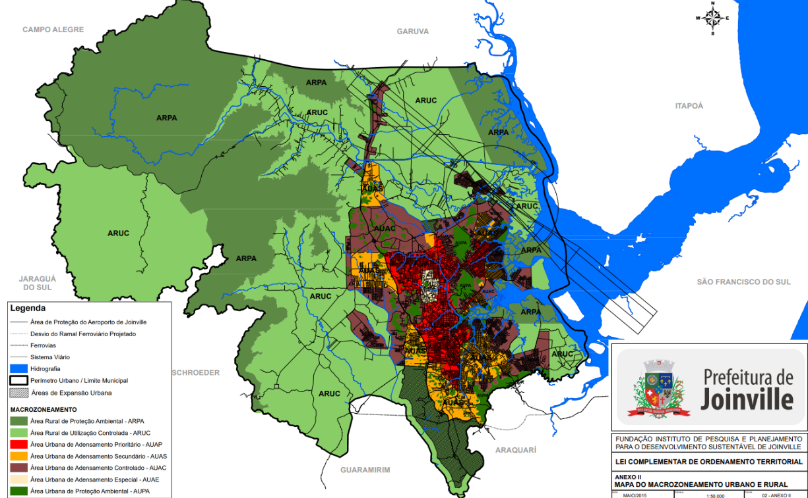

Fonte: https://www.joinville.sc.gov.br/wp-content/uploads/2017/02/Anexo-II-à-LC-nº-470-2017-Mapa-do-macrozoneamento-urbano-e-rural-versão-de-maio-de-2015.pdf

## Modelo de Gravidade

O Modelo de Gravidade é utilizado para estimar o número de viagens entre os vertiportos e as macrozonas, considerando as seguintes variáveis:

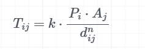

Onde:

Tij  – número de viagens entre o vertiporto i e a macrozona j

Pi – fator de produção do vertiporto i

Aj – fator de atração da macrozona j

dij – distância ou tempo de viagem entre i e j

n – parâmetro de impedância a ser calibrado

k – constante de proporcionalidade

Fator de produção dos possíveis sítios

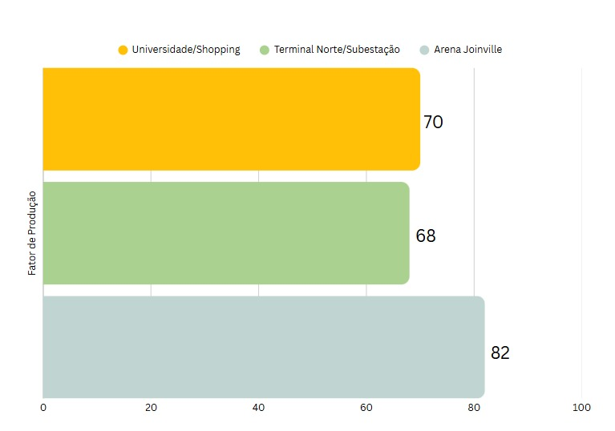

Fonte: Autores

Para o fator de atração Aj, adota-se uma porcentagem, estimativa, das viagens com destino à respectiva macrozona. Esse valor é utilizado de forma aproximada, considerando que apenas uma fração muito pequena das viagens realizadas para cada macrozona ocorrerá por meio do modal aéreo, utilizando aeronaves eVTOL, inicialmente.

Fator de produção das macrozonas

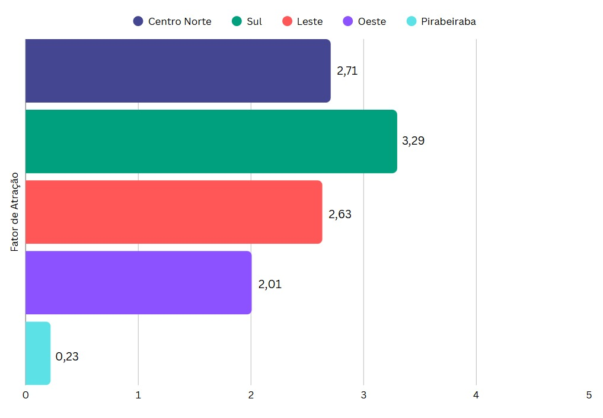

Fonte: Autores

O deslocamento dij é obtido a partir de uma matriz com as distâncias, em km, entre cada sítio e macrozona.

Matriz da distância entre possíveis sítios e macrozonas

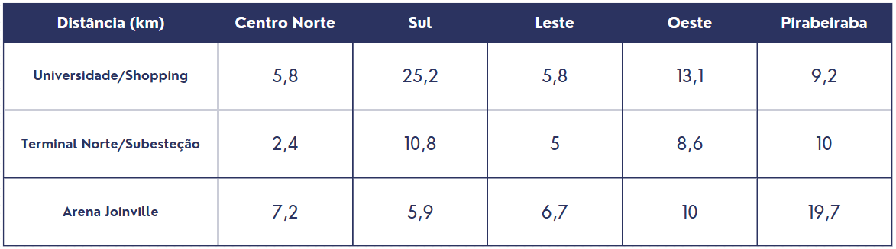

Fonte: Autores

É importante destacar que, em aplicações tradicionais, o parâmetro de impedância penaliza viagens mais longas, no entanto, no contexto das viagens entre vertiportos em Joinville as distâncias variam muito visto a dimensão da cidade, com algumas sendo de caráter mais longo. Assim, viagens mais longas dentro desse limite são, na verdade, desejáveis para garantir maior eficiência operacional, visto que deslocamentos muito curtos são mais adequadamente atendidos por veículos terrestres, que oferecem tempos de viagem semelhantes e custos mais baixos.

A constante de proporcionalidade k foi definida para garantir que os resultados estivessem em uma escala realista e interpretável em relação à quantidade esperada de viagens. É importante ressaltar que, se k fosse maior do que a quantidade de viagens esperadas, o modelo estimaria uma quantidade mais elevada de viagens, contudo, conforme já mencionado, espera-se que apenas uma pequena fração das viagens ocorra via eVTOL inicalmente.

A aplicação do modelo, com os parâmetros definidos, gera a matriz origem-destino estimada, a qual expressa o número relativo de viagens partindo de cada vertiporto em direção às diferentes macrozonas. Essa matriz permite identificar tendências de fluxo, zonas com maior atratividade e fornece subsídios importantes para decisões relacionadas à localização ideal de vertiportos, ao planejamento de rotas e à integração modal.

Matriz de origem-destino entre possíveis sítios e macrozonas

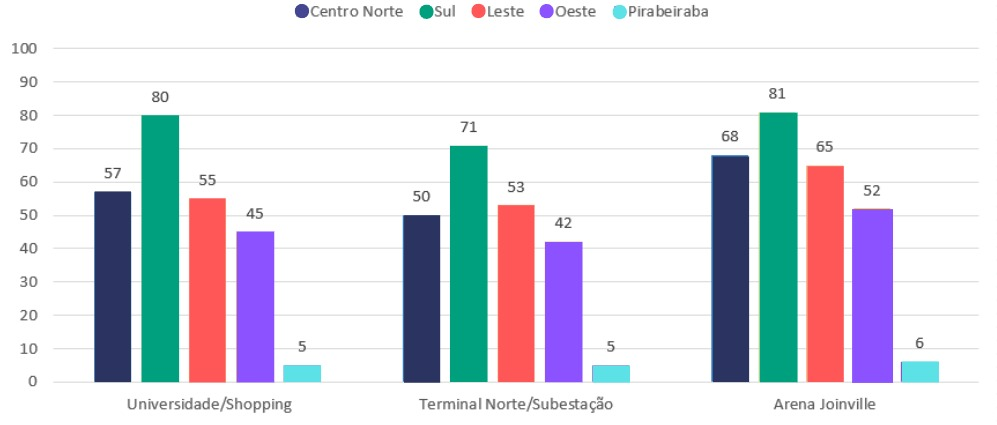

Fonte: Autores

A matriz origem-destino revela tendências de fluxo compatíveis com os perfis de produção e atração estabelecidos. A Arena de Joinville, que apresenta o maior fator de produção (Pi = 81), concentra os maiores volumes de viagens estimadas, destacando-se nas conexões com as macrozonas Sul e Centro Norte, justamente aquelas com os maiores fatores de atração.

O sítio Universidade/Shopping também se sobressai, especialmente nas ligações com o Sul e o Centro Norte, refletindo seu relevante potencial comercial, sua localização estratégica e a baixa distância, favorecida pelo parâmetro de impedância negativo. Esse valor de n inverte o efeito tradicional da impedância, privilegiando deslocamentos ligeiramente mais longos, o que é coerente com a lógica de que viagens muito curtas tendem a ser mais bem atendidas por modos terrestres convencionais.

Por outro lado, o sítio Terminal Norte/Subestação apresenta volumes de viagens mais modestos, o que é consistente com seus menores fatores de produção.

## Modelo de Huff

O Modelo de Huff é aplicado para estimar a probabilidade de um usuário, pertencente a uma determinada macrozona, escolher um vertiporto específico. A escolha é baseada na atratividade da alternativa e na distância necessária para acessá-la. Esse modelo se mostra especialmente útil para analisar o comportamento de decisão dos usuários em cenários com múltiplas opções de transporte:

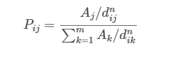

Para sua aplicação, são consideradas as seguintes variáveis:

Pij – probabilidade de um usuário da zona i escolher o vertiporto/modo j

Aj – atratividade do vertiporto/modo j

dij – distância ou tempo de viagem entre i e j

n – parâmetro de sensibilidade à distância

m – número de alternativas disponíveis

Para a aplicação do modelo, foram utilizadas as mesmas macrozonas e sítios utilizados no Modelo de Gravidade.

A atratividade Aj de cada sítio foi atribuída com base na nota final dos oito critérios de avaliação, conforme determinado pelos métodos AHP e AIP no processo de escolha do sítio.

O deslocamento dij também seguiu o mesmo parâmetro adotado anteriormente, considerando as distâncias aéreas entre macrozonas e vertiportos.

O parâmetro de sensibilidade à distância foi definido a partir de iterações que analisaram o comportamento das probabilidades geradas pela equação, buscando manter a atratividade de viagens eVTOL para destinos mais distantes. Essa escolha segue a mesma lógica apresentada no modelo de gravidade, favorecendo a eficiência do transporte em distâncias maiores.

A aplicação do modelo gera a matriz de probabilidades Pij​, que expressa a probabilidade de um usuário de cada macrozona escolher um determinado vertiporto como ponto de partida ou de chegada.

## Matriz de probabilidades de escolha entre macrozonas e sítios vertiportuários

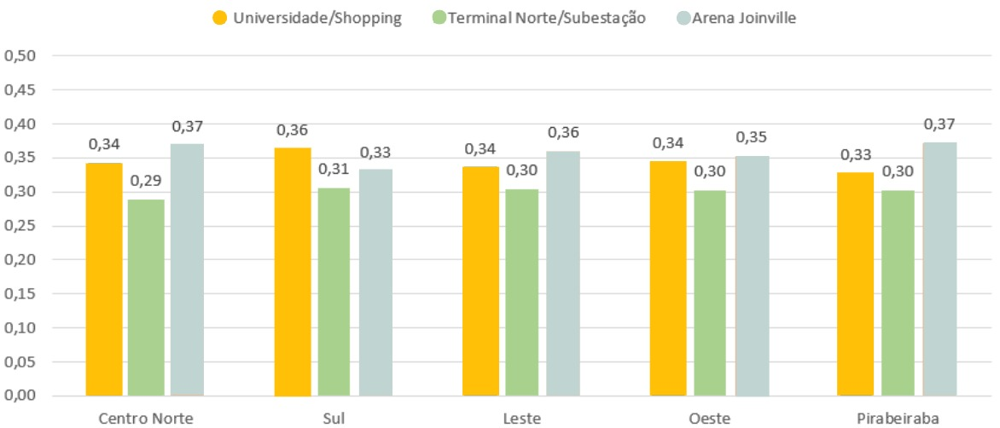

Fonte: Autores

A aplicação do Modelo de Huff gerou uma matriz de probabilidades de escolha para cada vertiporto, considerando a atratividade atribuída a partir dos critérios e a penalização da distância, representada pelo parâmetro n.

Os resultados mostram que a Arena Joinville concentra as maiores probabilidades de escolha em praticamente todas as macrozonas, variando entre 33% e 37%. Esse desempenho reflete sua alta atratividade total, associada a distâncias competitivas mesmo em relação às macrozonas mais afastadas.

O sítio localizado próximo a Universidade de Joinville e Shopping Garten, com uma atratividade intermediária, apresenta probabilidades médias entre 33% e 36%, demonstrando preferência especialmente nas zonas Sul e Centro Norte, onde sua posição geográfica e o equilíbrio entre atratividade e custo de deslocamento proporcionam vantagem.

O sítio localizado entre o Terminal Norte e a Subesteção, embora tenha uma nota geral de atratividade inferior, mantém probabilidades consistentes entre 29% e 31%, indicando que sua boa localização e facilidade de acesso compensam, em parte, sua atratividade mais modesta.

Essa análise das probabilidades nos permite refletir o comportamento provável de escolha dos usuários em um cenário com múltiplas opções de vertiportos, visualizar o impacto direto da atratividade total na decisão dos usuários, mesmo em situações com diferenças de distância e apoiar a priorização de investimentos e a definição de estratégias operacionais específicas para cada sítio vertiportuário.

Assim como no Modelo de Gravidade, o estudo com o Modelo de Huff apresenta limitações relacionadas à abordagem e aos dados utilizados. Em ambos os casos, as estimativas refletem, em parte, as escolhas iniciais dos autores, o que pode direcionar os resultados para tendências previamente esperadas.

Por fim, a análise integrada dos Modelos de Gravidade e de Huff revela resultados consistentes, mas com ênfases distintas: enquanto o Modelo de Gravidade projeta a quantidade de viagens entre origens e destinos, o Modelo de Huff foca na probabilidade relativa de escolha entre as alternativas disponíveis.

Em conjunto, os modelos oferecem uma análise completa — o de Gravidade quantifica a demanda, e o de Huff, a atratividade relativa —, otimizando o planejamento e operações de vertiportos.