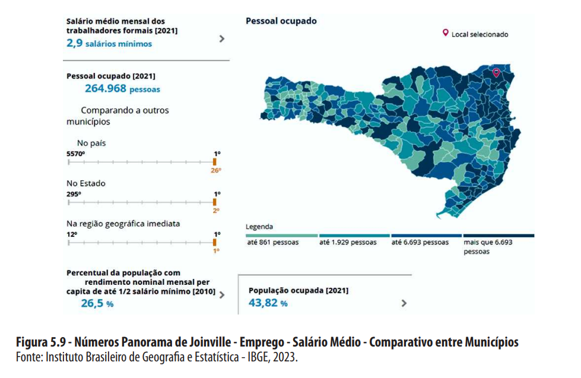
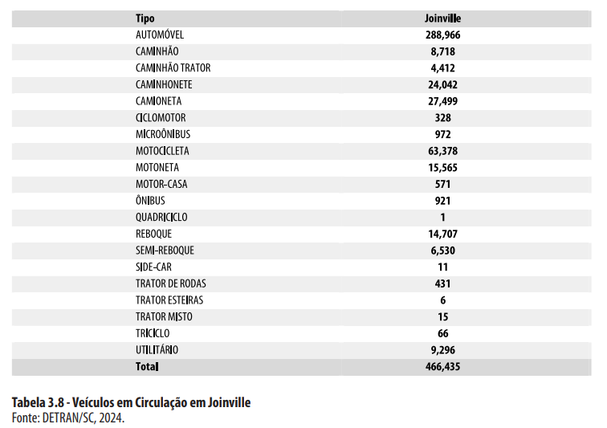

# Table of Contents
1. [Cidade escolhida: Joinville-SC](#introduction)
2. [Example2](#example2)
3. [Third Example](#third-example)

## 1. **Cidade escolhida: Joinville-SC** 

## 2. **Critérios de Escolha**

_Figura 1: Índice de Cidades Empreendedoras ENAP, 2023[1]._

- Inovação;
- Porte do município;  
---

## 3. **Dados da Cidade**

_Figura 2: Referências de Joinville, 2023[1] e 2024[2]._

---

## 4. **Destaques dos Dados**

### 4.1 **Cultura de Inovação**

_Figura 3: Centros de Inovação, SCTI[3]._

- Centros de Inovação;
- Starups (modelos de negócio);
- Aceitação social.

##### 4.2 **Aspectos Demográficos, Socioeconômicos e Culturais**

Cidade estratégica localizada no norte de Santa Catarina, destacando-se como um importante polo industrial e econômico do estado. Conhecida como a *"Cidade das Flores"* devido à sua rica flora, Joinville é um dos principais centros industriais do Brasil, com forte presemça nos setores **metalúrgico, têxtil e de tecnologia**.

Sua **localização próxima à cidade de Curitiba (capital estadual) e ao litoral catarinense (polo turístico)**, aliada à diversidade de setores econômicos, faz de Joinville uma cidade vibrante, com forte crescimento e grande influência na economia regional e nacional.

**Destaques da Cidade**

- Infraestrutura moderna e bem desenvolvida;
- Alto índice de qualidade de vida;
- Centro industrial e logístico de grande relevância;
- Cultura rica.

**Dados Gerais**

- **Área Territorial:** 1.127,947 km² (*IBGE*)  
- **População (IBGE 2022):** 616.317 habitantes  
- **Densidade demográfica:** 546,41 hab/km²  
- **PIB per capta:** R$ 74.532,00
- **Renda média:** R$ 3.488,14

_Figura 4: Divisão Territorial, SIMGeo [4]._

_Figura 5: Remuneração Média Mensal, RAIS[5]._

_Figura 6: Salário Médio Mensal, IBGE[6]._

##### 4.3 **Transporte Multimodal**

**Rodoviário**

_Figura 7: Principais Acessos a Joinville, SEPUR[2]._

_Figura 8: Veículos em Circulação em Joinville, DETRAN[2]._

_Figura 9: Número de viagens por modal de transporte, DETRAN[2]._

**Aéreo - Aeroporto Lauro Carneiro de Loyola**

_Figura 10: Índice de Cidades Empreendedoras ENAP, 2023[7]._

Aproximadamente 5 mil movimentos de aeronaves anuais. UAM como gerador de demanda (elavação de movimento) de aeronaves. Concessionária como stakeholder e possível parceira.

**Portuário**

5 portos distando a menos de 125Km:

- Porto de Navegantes - distância: 88 km 

- Porto de Itajaí - distância: 93 km

- Porto de Itapoá - distância: 79 km

- Porto de São Francisco do Sul - distância: 61 km

- Porto de Paranaguá - distância: 125 km

**Por bicicleta**

_Figura 11: Rede cicloviária de Joinville, SEPUR[2]._

Extensa malha de ciclovias.

**Ferroviário**

A ferrovia que passa pelo limite municipal de Joinville liga a região do porto em São Francisco do Sul à cidade de Mafra. Nesta cidade há conexão ferroviária à malha nacional para Porto Alegre, São Paulo e todo Paraná. A carga transportada inclui farelo de soja, trigo, sucata, cerâmica e bentonita, soja, óleo degomado, sorgo, aveia, milho, fertilizantes, minério de ferro, bobina de aço, ferro gusa e refrigeradores. É necessário aprofundar informações para compreender as associações com o UAM.

##### 4.4 **Capacidade de Distribuição Elétrica**

_Figura 12: Linhas de Transmissão Elétrica, Celesc[2]._

- Distribuição estável, com baixo índice de interrupção;
- Investimento para expansão da distribuição de matriz fotovoltaica.

---

#### 5. **Alinhamento UAM**

Identificar possíveis aplicações UAM em Joinville, segundo a literatura disponível.

_Figura 13: Modalidades de serviços de transporte aéreo, UAM[8]._

_Figura 14: Parâmetros técnicos, UAM[8]._

_Figura 15: Diferentes demandas do UAM, Oi Long[9]._
