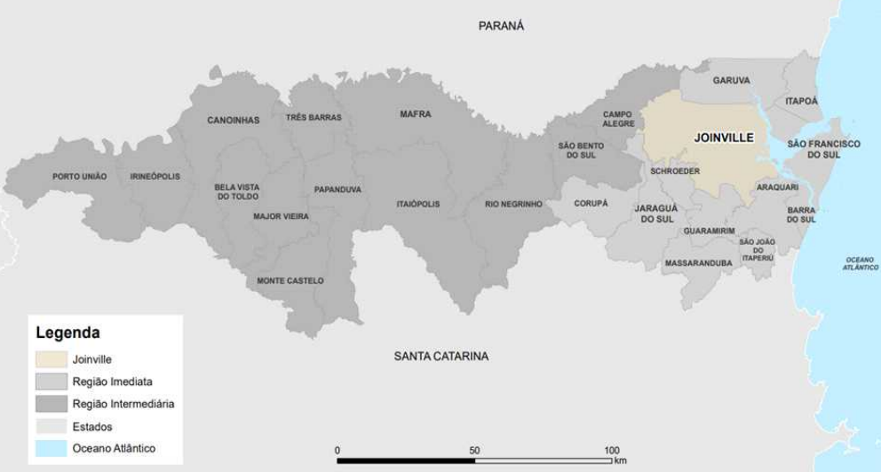

# Sobre Joinville

Joinville é uma cidade estratégica localizada no norte de Santa Catarina, destacando-se como um importante polo industrial e econômico do estado. Conhecida como a *"Cidade das Flores"* devido à sua rica flora, Joinville é um dos principais centros industriais do Brasil, com forte presença nos setores **metalúrgico, têxtil e de tecnologia**.

## **Destaques da cidade**
- Infraestrutura moderna e bem desenvolvida  
- Alto índice de qualidade de vida  
- Centro industrial e logístico de grande relevância  
- Cultura rica  

Sua localização próxima ao litoral catarinense e à cidade de Curitiba, aliada à diversidade de setores econômicos, faz de Joinville uma cidade vibrante, com forte crescimento e grande influência na economia regional e nacional.

Figura 1: Índice de Cidades Empreendedoras ENAP, 2023[1].

---

## **Divisão Geográfica**
A cidade de Joinville pode ser dividida em **sete regiões geográficas principais** (macrozonas):

- **Centro**  
- **Norte**  
- **Sul**  
- **Sudeste**  
- **Leste**  
- **Oeste**  
- **Extremo Norte**  

**Regiões mais populosas:** Centro e Sul  
**Regiões com maior densidade populacional:** Centro e Leste  

Cada uma dessas regiões apresenta características únicas:  
- O **Centro** concentra atividades comerciais e administrativas.  
- As regiões **Norte e Oeste** se destacam por suas áreas industriais e rurais.  
- A **zona Sul** é conhecida por sua grande expansão residencial e infraestrutura de lazer.  

### **Dados Gerais**
- **Área Territorial:** 1.127,947 km² (*IBGE*)  
- **População (IBGE 2022):** 616.317 habitantes  
- **Densidade demográfica:** 546,41 hab/km²  

### **Mapas e Recursos**
- [Mapa da área urbana de Joinville - ResearchGate](#)  
- [Mapa de Densidade Demográfica - Prefeitura de Joinville](#)  

---

## **Camada 1: Dados Geoespaciais e Regulatórios**
### **Fontes de Dados Geoespaciais**
- [IBGE - Dados sobre Joinville](https://www.ibge.gov.br/cidades-e-estados/sc/joinville.html)  
- **Mapa interativo disponível no GitHub**  

### **Leis e Regulamentações**
- **Lei Complementar nº 27/96:** Normas de uso e ocupação do solo ([Leis Municipais](https://metaimoveisjoinville.com.br))  
- **Lei Complementar nº 470 (LOT):** Parcelamento, uso e ocupação do solo ([Gmais](https://metaimoveisjoinville.com.br))  
- **Emendas à Lei de Uso e Ocupação do Solo:** [Disponível no NSC Total](#)  

### **Licenciamento e Impactos Urbanos**
- O **licenciamento ambiental** é essencial para projetos urbanos como vertiportos.  
- O **Plano de Mobilidade Urbana de Joinville** pode impactar a instalação de novas infraestruturas.  
- O **Plano Diretor de Joinville** define as diretrizes para o crescimento da cidade.  

### **Bases de Dados GIS**
- **[SIMGeo - Sistema de Informações Municipais Georreferenciadas](https://geo.joinville.sc.gov.br/portal/apps/simgeo/index.html)**  
  - Restituições aerofotogramétricas  
  - Fotos aéreas  
  - Arquivos vetoriais (DWG, Shapefile)  
  - Mapas em PDF  
- **Restituições Aerofotogramétricas Históricas** (1938 e 1966)  
- **Mapas Geológicos e Hidrogeológicos** (SGB)  
- **[OpenStreetMap](https://www.openstreetmap.org/)** (dados colaborativos geoespaciais) 

---
## **Camada 2: Transporte e Sociodemografia**  

Figura 2: Municípios Integrantes das intermediações de Joinville[2].

Figura 3: Totalidade de quilometros quadrados de extensão das regiões próximas a Joinville[2].

Figura 4: Divisão Administrativa de Joinville[2].

Figura 5: Municípios integrantes das regiões geográficas imediata e intermediária de Joinville[2].

Figura 6: Principais acessos a Joinville[2].

Distâncias dos Portos até 125Km:
- Porto de Navegantes - distância: 88 km de Joinville
- Porto de Itajaí - distância: 93 km de Joinville
- Porto de Itapoá - distância: 79 km de Joinville
- Porto de São Francisco do Sul - distância: 61 km de Joinville
- Porto de Paranaguá - distância: 125 km de Joinville

Figura 7: Padrão de deslocamento dos joinvilenses pelo município[3].

Figura 8: Pontos de tráfego intenso em horário de pico[4].

