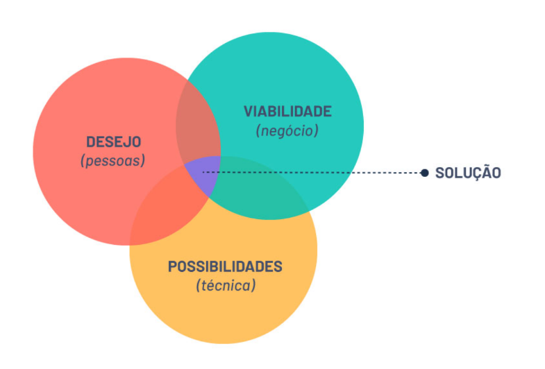
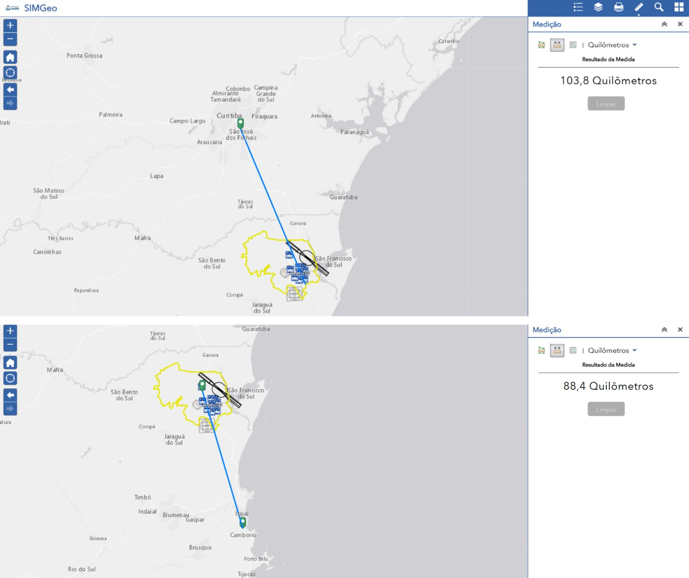

# Cidade de Joinville e principais características

## 1. **Cidade escolhida: Joinville-SC**

## 2. **Critérios de Escolha**


_Figura 1: Índice de Cidades Empreendedoras ENAP, 2023[1]._

- Inovação;
- Porte do município;  
---

## 3. **Dados da Cidade**


_Figura 2: Referências de Joinville, 2023[1] e 2024[2]._

---

## 4. **Destaques dos Dados**

### 4.1 **Cultura de Inovação**


_Figura 3: Centros de Inovação, SCTI[3]._

- Centros de Inovação;
- Starups (modelos de negócio);
- Aceitação social.


### 4.2 **Aspectos Demográficos, Socioeconômicos e Culturais**

Cidade estratégica localizada no norte de Santa Catarina, destacando-se como um importante polo industrial e econômico do estado. Conhecida como a *"Cidade das Flores"* devido à sua rica flora, Joinville é um dos principais centros industriais do Brasil, com forte presemça nos setores **metalúrgico, têxtil e de tecnologia**.

Sua **localização próxima à cidade de Curitiba (capital estadual) e ao litoral catarinense (polo turístico)**, aliada à diversidade de setores econômicos, faz de Joinville uma cidade vibrante, com forte crescimento e grande influência na economia regional e nacional.

**Destaques da Cidade**

- Infraestrutura moderna e bem desenvolvida;
- Alto índice de qualidade de vida;
- Centro industrial e logístico de grande relevância;
- Cultura rica.

**Dados Gerais**

- **Área Territorial:** 1.127,947 km² (*IBGE*)  
- **População (IBGE 2022):** 616.317 habitantes  
- **Densidade demográfica:** 546,41 hab/km²  
- **PIB per capta:** R$ 74.532,00
- **Renda média:** R$ 3.488,14


_Figura 4: Divisão Territorial, SIMGeo [4]._


_Figura 5: Remuneração Média Mensal, RAIS[5]._


_Figura 6: Salário Médio Mensal, IBGE[6]._


### 4.3 **Transporte Multimodal**

**Rodoviário**


_Figura 7: Principais Acessos a Joinville, SEPUR[2]._


_Figura 8: Veículos em Circulação em Joinville, DETRAN[2]._


_Figura 9: Número de viagens por modal de transporte, DETRAN[2]._

**Aéreo - Aeroporto Lauro Carneiro de Loyola**


_Figura 10: Índice de Cidades Empreendedoras ENAP, 2023[7]._

Aproximadamente 5 mil movimentos de aeronaves anuais. UAM como gerador de demanda (elavação de movimento) de aeronaves. Concessionária como stakeholder e possível parceira.

**Portuário**

5 portos distando a menos de 125Km:

- Porto de Navegantes - distância: 88 km 

- Porto de Itajaí - distância: 93 km

- Porto de Itapoá - distância: 79 km

- Porto de São Francisco do Sul - distância: 61 km

- Porto de Paranaguá - distância: 125 km


**Por bicicleta**


_Figura 11: Rede cicloviária de Joinville, SEPUR[2]._

Extensa malha de ciclovias.

**Ferroviário**

A ferrovia que passa pelo limite municipal de Joinville liga a região do porto em São Francisco do Sul à cidade de Mafra. Nesta cidade há conexão ferroviária à malha nacional para Porto Alegre, São Paulo e todo Paraná. A carga transportada inclui farelo de soja, trigo, sucata, cerâmica e bentonita, soja, óleo degomado, sorgo, aveia, milho, fertilizantes, minério de ferro, bobina de aço, ferro gusa e refrigeradores. É necessário aprofundar informações para compreender as associações com o UAM.

### 4.4 **Capacidade de Distribuição Elétrica**


_Figura 12: Linhas de Transmissão Elétrica, Celesc[2]._

- Distribuição estável, com baixo índice de interrupção;
- Investimento para expansão da distribuição de matriz fotovoltaica.

---

## 5. **Alinhamento UAM**

Identificar possíveis aplicações UAM em Joinville, segundo a literatura disponível.


_Figura 13: Modalidades de serviços de transporte aéreo, UAM[8]._


_Figura 14: Parâmetros técnicos, UAM[8]._


_Figura 15: Diferentes demandas do UAM, Oi Long[9]._


_Figura 16: Tráfego de Joinville em horário de pico, Google._


### **5.1 Casos de uso e subdivisão de operações**

Para a realidade de Joinville, em função da configuração espacial, os casos de uso podem
ser aglutinados em 3 categorias, se subdividindo em 14 possíveis aplicações/oportunidades.


_Figura 17: Casos de uso para 30 km_


_Figura 18: Casos de uso para 50-70 km_


_Figura 19: Casos de uso para 100 km_

### **5.2 Modelo lógico de tomada de decisão**

Premissa “Possível, Viável, Desejável” da inovação, adaptada para o problema: criar
infraestrutura UAM.

**Possível:** é falar de viabilidade técnica do projeto em curto prazo, ou seja,
considerarmos se é tecnologicamente possível realizar o que está sendo proposto,
analisando neste ponto se será possível atender os objetivos de desempenho
esperados pela empresa.

**Viável:** se refere ao retorno esperado de uma solução. De nada adianta ter uma ideia
revolucionária se ela não é viável financeiramente. Esta análise de viabilidade permite
a captação de investimentos, a definição do mercado, o estudo dos riscos e
alternativas e reduz chances de erros e impactos negativos. Esse processo otimiza o
uso dos recursos, melhora resultados e maximiza o retorno, proporcionando
segurança e estabilidade.

**Desejável:** o foco são as pessoas, já que elas serão beneficiadas pela inovação
desenvolvida e aqui vemos que inovação não é apenas sinônimo de tecnologia de
ponta, mas resulta do valor que o cliente percebe. Para isso, a pesquisa de mercado,
o mapa de empatia e as entrevistas e testes com clientes são fundamentais tornando
possível se colocar no lugar do cliente e realmente entender suas necessidades reais.



_Figura 20: 3 Círculos da Inovação_

```
A adaptação se dá no ponto de que normalmente na inovação é normal que a
avaliação do “desejo” acontece antes das demais, pois o desenvolvimento de uma
solução está baseado na dor do usuário. Conceito “cabelo pegando fogo”.
```

### **5.3 Análise em primeira instância: possibilidade técnica e escolha de sítios**

Após o consenso do grupo sobre as aplicações/oportunidades UAM mais moldadas
à realidade de Joinville (Airport Shuttle; Air Taxi; Air Taxi Intercidades; Evacuação
Médica; Turístico), com a finalidade de filtrar os dados mais relevantes para a análise
dentro dos critérios estabelecidos, foi aplicado o método Analytic Hierarchy Process -
AHP para realizar a priorização dos critérios.


_Figura 21: Critérios de Localização de Sítios Vertiportuários_


Análises individuais dos critérios: 

 

_Figura 22: Aplicação individual do método AHP._

A figura abaixo resume a análise e a tomada de decisão até o momento:


O ideal seria aplicar a lógica em todas as aplicações/oportunidades UAM em Joinville,
a fim de identificar quais seriam mais viáveis e poderiam compor um único
empreendimento.

 

_Figura 23: Amplitude ideal da avaliação dos critérios de escolha (elaboração própria)_

A figura abaixo resume a análise e a tomada de decisão até o momento:

 


Exemplos dos dados relevantes para a escolha dos sítios:


_Figura 24: Dados de aeródromos e helipontos_


_Figura 25: Integração com o modal rodoviário (terminais)_


_Figura 26: Integração com o modal rodoviário (malha viária)_


_Figura 27: Distribuição de Rede de Alta tensão_



_Figura 28: Distâncias de centros urbanos relevantes_

Assim, os seguintes sítios foram escolhidos como possibilidade de aplicação de vertiportos.


_Figura 29: Possível sítio_


_Figura 30: Possível sítio_


_Figura 31: Possível sítio_

Uma infraestrutura crítica para a efetividade de um vertiporto visando multíplas aplicações, atendendo diversos setores da cidade, é a disponibilidade de vagas para o estacionamento de diversos veículos, atendendo carros, motos e bicicletas. Como essa disponibilidade de vagas não foi encontrada em nenhum ponto da cidade, vislumbra-se a possibilidade da construção de um prédio garagem para receber o vertiporto por Parceria Público-Privada (Lei Municipal nº 9.048/2021), com vários parceiros. Nesse contexto, o sítio do estacionamento da Arena Joinville parece ser o mais apropriado, pois além de estar alinhado com a lógica do AHP, ainda favorece a diversidade de negócios a serem explorados, como:

   - transporte aéreo por eVTOL nas aplicações Airport Shuttle, Air Taxi, Air Taxi Intercidades, Evacuação Médica e Turístico;

   - ampliação da capacidade de estacionamento de veículos, inclusive para fins rotativos;

   - centro gastronômico permanente, com marcas exclusivas;

   - novos camarotes, com visão para a arena, para eventos esportivos diversos e shows, com serviço de buffet do centro gastronômico;

   - instalação de parque de manutenção de eVTOL de pequeno porte.
