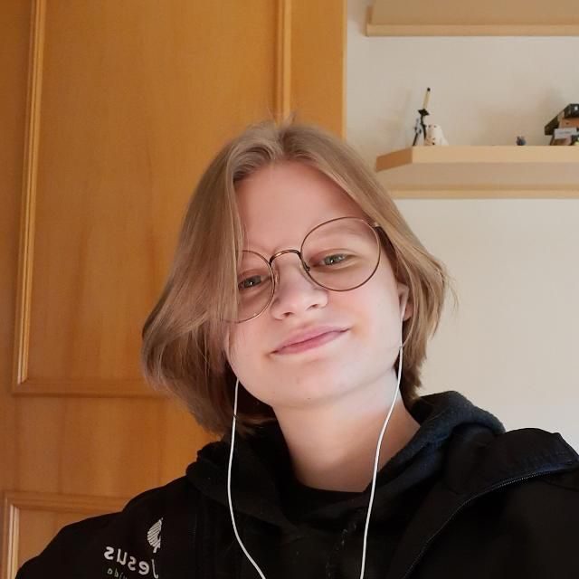
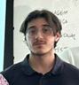
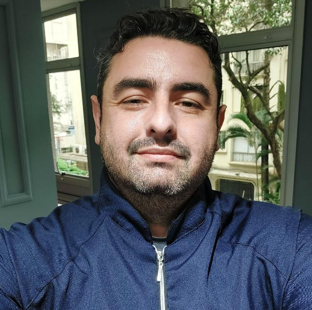
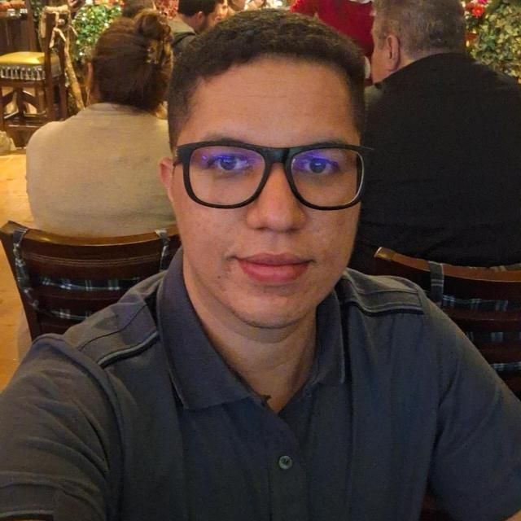

# Projeto de Vertiporto - Grupo B

Bem vindos à página de Projeto de Vertiporto do Grupo B! 

Este repositório contém as análises desenvolvidas durante a disciplina IT 214 Mobilidade Aérea Urbana, como forma de avaliação dos alunos integrantes do Grupo B.

A cidade escolhida para a pesquisa desenvolvida foi a cidade de Joinville, no estado de Santa Catarina.

<iframe src="https://geo.joinville.sc.gov.br/portal/apps/simgeo/index.html?id=0e2ffa64f4254dda952757813efb6565" width="100%" height="600px" style="border: none;"> </iframe>

<h2 style="text-align: center; margin-top: 3rem;">Integrantes</h2>

  

    <!-- Membro 1 -->
    

      

        
      

      
Betina Lenhard

      
Engenharia Aeroespacial Mestrado CTE-E

    

    <!-- Membro 2 -->
    

      

        
      

      
Rodrigo Furlan

      
Engenharia Civil Mestrado EIA-T

    

    <!-- Membro 3 -->
    

      

        
      

      
Enzo Picchiello

      
Logística / Biomedicina Doutorado EIA-T Analista Pleno

    

    <!-- Membro 4 -->
    

      

        
      

      
Guilherme Cabral

      
Engenharia Aeroespacial Mestrado EIA-T

    

    <!-- Membro 5 -->
    

      

        
      

      
Walter Sá

      
Ciências Jurídicas Mestrado FEA-USP Analista Pleno

    

  

